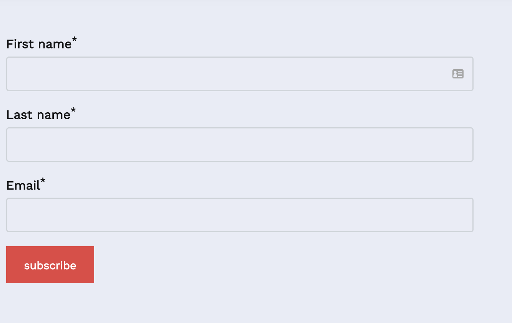
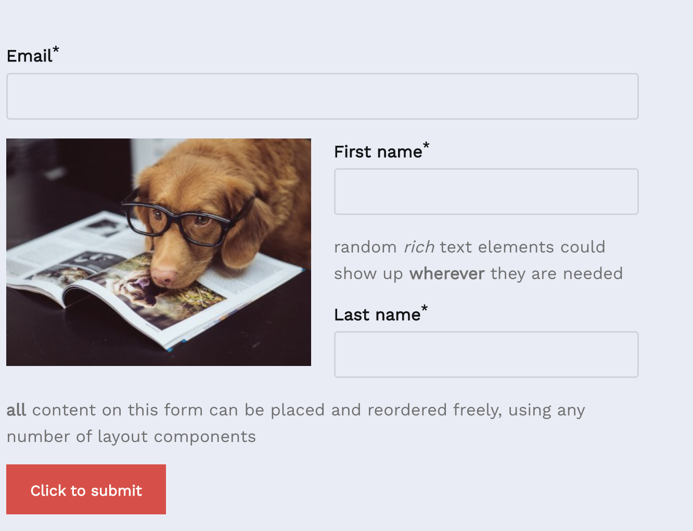
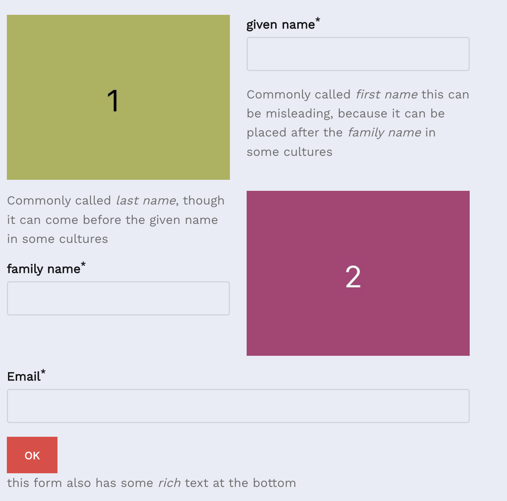

# Welcome to Wagtail Formation's documentation

This module aims to provide an easy-to-use, flexible and extensible way to implement dynamic forms in a [Wagtail](https://docs.wagtail.org/en/latest/) based CMS.

There are currently several ways to achieve (somewhat) dynamic forms in Wagtail, but these can have problematic
restrictions;

* [Form builder](https://docs.wagtail.org/en/stable/reference/contrib/forms/index.html), wagtail's very own
  implementation. This module assumes you create an entire page dedicated to a single form. This means we won't be able
  to use multiple forms on one page, and can't add forms as an element to more generic page types.
* [Wagtail Streamforms](https://wagtailstreamforms.readthedocs.io/en/latest/advanced.html), an implementation that aims
  to provide forms in a page's streaming content. This is handled through a chooser, which means that pages will only
  hold a reference to a form object. This can be overly restrictive.
* [Wagtail Form Blocks](https://wagtailformblocks.readthedocs.io/en/latest/), another implementation that relies on a
  chooser. It provides very limited flexibility as to what a form actually does, and also makes rendering the form
  somewhat convoluted for more complex layouts.

Formation aims to find a solution for these limitations.

Given any typical form requirements, a form block can be written and made available to a content editor. The content
editor will then be able to create whatever layout they want, with full wagtail `StreamBlock` flexibility. The form will
then do whatever it was written to do, and isn't only restricted to basic email sending, for instance. The following
are all examples of the exact same form type, with different custom layouts;

